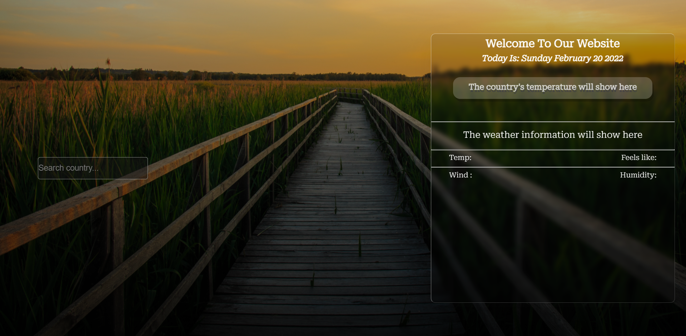
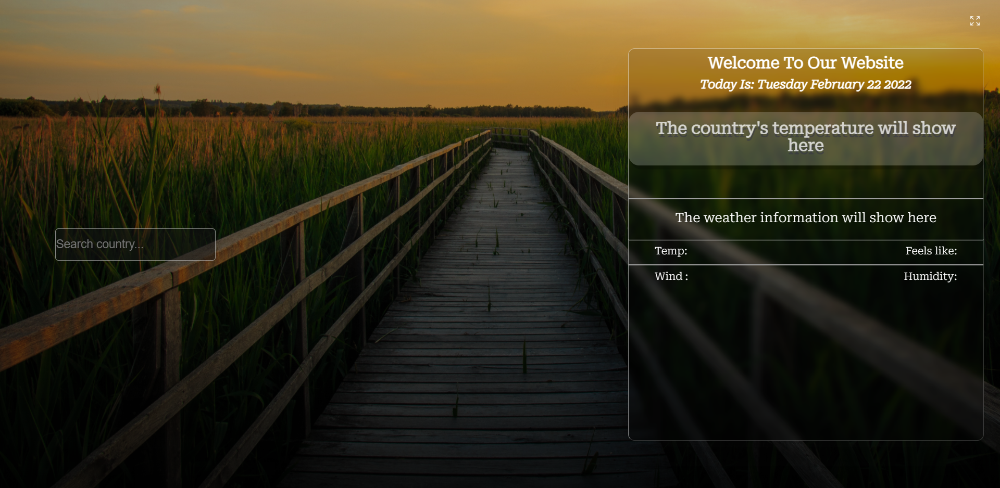
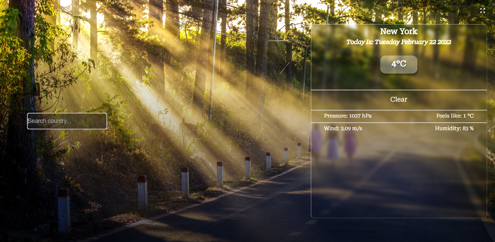
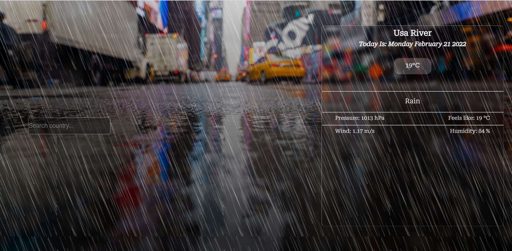
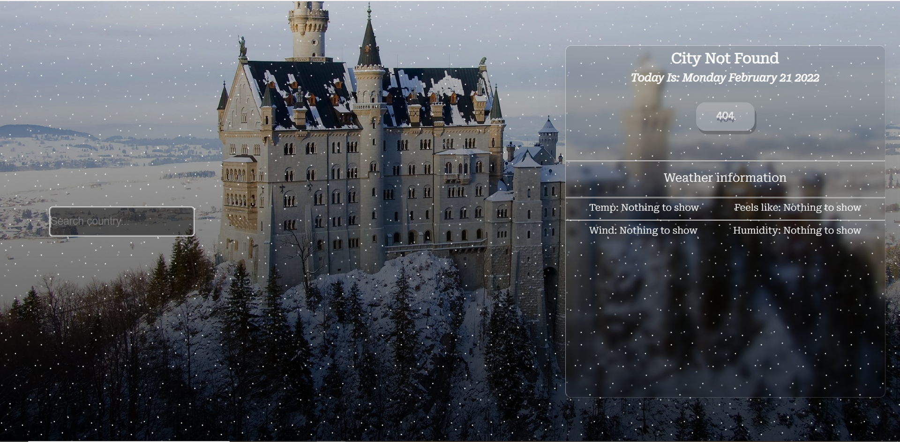

### What is this project ?

This is my simple ReactJs tracking weather website that you can search for weather information from about 200 countries around the world. This project uses weather API from <a href="https://openweathermap.org/api">https://openweathermap.org/api</a> and adds some awesome css effects.

<h1>Install this Todo_list_app:</h1>

1. Clone this github respository

2. Download node in: https://nodejs.org/en/

3. Open your terminal to the folder location, type: npm install

4. Run npm run start

<h1>Technologies used in this project</h1>

Reactjs, javascript, html, css

<h1>Screenshot from the app:</h1>

Default screen:

Clouds screen:

Clear screen:

Rain screen:

Error & Snow screen:

